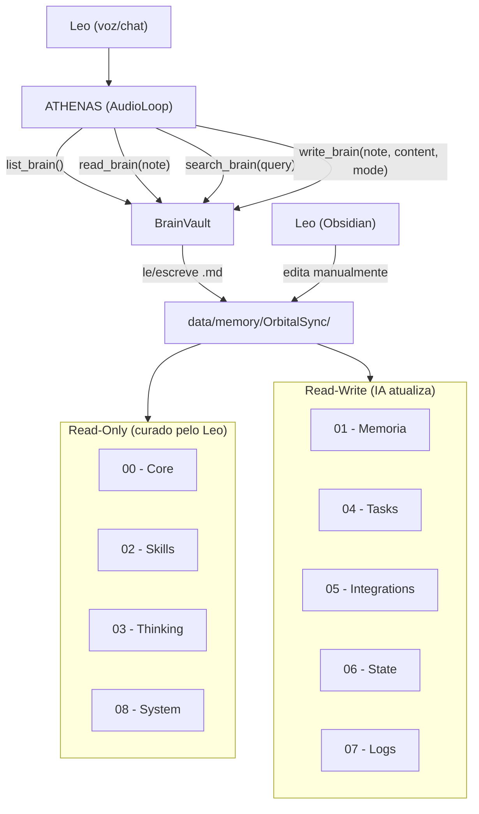

# Integracao do Cerebro Obsidian na ATHENAS

## Analise da situacao atual

A ATHENAS hoje tem:

- Tools genericas `read_file`/`write_file` (write restrito ao diretorio do projeto)
- System instruction monolitica hardcoded em `[gemini_setup.py](backend/orbital/assistant/gemini_setup.py)`
- Memoria via JSONL + Supabase (historico de chat), sem acesso estruturado ao vault
- Nenhuma referencia ao Obsidian no backend

O vault em `[data/memory/OrbitalSync/](data/memory/OrbitalSync)` tem 28 notas .md em 9 pastas, majoritariamente templates vazios conectados por wikilinks, com o `[Loop_de_execucao.md](data/memory/OrbitalSync/08 - System/Loop_de_execucao.md)` como ponto de entrada.

## Decisoes de design (definidas com Leo)

- **Leitura e escrita**: a IA le E escreve no vault (nao apenas leitura)
- **Sob demanda**: a IA consulta/atualiza via tool calls quando precisa (nao carrega tudo no startup)
- **Auto-crescimento**: a IA pode criar notas novas em qualquer pasta RW
- **Pastas RW**: 01-Memoria, 04-Tasks, 05-Integrations, 06-State, 07-Logs
- **Pastas RO**: 00-Core, 02-Skills, 03-Thinking, 08-System (curadas pelo Leo)

---

## As 3 camadas de inteligencia do cerebro

### Camada 1: Roteamento -- ONDE escrever

A IA precisa saber qual nota usar para cada tipo de informacao. Isso e resolvido por um **mapa de roteamento** no system instruction:

- Preferencia do usuario (gosta de cafe sem acucar, usa dark mode) -> `01 - Memoria/Usuario.md` (append)
- Padrao ou insight aprendido -> `01 - Memoria/Aprendizados.md` (append)
- Contexto do que esta acontecendo agora -> `06 - State/Contexto_atual.md` (overwrite)
- O que o usuario quer neste momento -> `06 - State/Intencao_do_usuario.md` (overwrite)
- Modo de operacao (Assistente/Dev/Pesquisa) -> `06 - State/Modo_atual.md` (overwrite)
- Tarefa nova -> `04 - Tasks/Fila_de_tarefas.md` (append)
- Tarefa em andamento -> `04 - Tasks/Tarefas_ativas.md` (overwrite)
- Tarefa finalizada -> `04 - Tasks/Tarefas_concluidas.md` (append)
- Resumo de conversa -> `07 - Logs/Conversas.md` (append)
- Reflexao pos-conversa -> `07 - Logs/Reflexoes.md` (append)
- Nova integracao -> `05 - Integrations/Nome.md` (create)

Quando nenhuma nota existente faz sentido, a IA **cria uma nova nota** na pasta mais adequada (ver Camada 3).

### Camada 2: Triggers -- QUANDO acessar o cerebro

**Triggers de LEITURA (read_brain / search_brain):**


| Situacao                                              | O que ler                                                                 |
| ----------------------------------------------------- | ------------------------------------------------------------------------- |
| Leo pergunta algo pessoal ("voce lembra que eu...")   | `search_brain` com palavras-chave, depois `read_brain` na nota encontrada |
| Leo pede pra retomar algo ("continua aquele projeto") | `06 - State/Contexto_atual` + `search_brain`                              |
| Precisa decidir como abordar um problema              | `03 - Thinking/Tomada_de_decisao` ou `Resolucao_de_problemas`             |
| Leo menciona uma tarefa pendente                      | `04 - Tasks/Fila_de_tarefas` + `Tarefas_ativas`                           |
| Precisa saber quem e / como falar                     | `00 - Core/Identidade` + `Personalidade` + `Modo_de_fala`                 |
| Leo pergunta sobre algo que a IA ja aprendeu          | `search_brain` com o tema, depois `01 - Memoria/Aprendizados`             |
| Duvida sobre uma integracao                           | `05 - Integrations/` + `list_brain("05 - Integrations")`                  |


**Triggers de ESCRITA (write_brain):**


| Situacao                          | O que escrever                                                                    | Modo      |
| --------------------------------- | --------------------------------------------------------------------------------- | --------- |
| Leo revela uma preferencia        | `01 - Memoria/Usuario`                                                            | append    |
| A IA descobre um padrao util      | `01 - Memoria/Aprendizados`                                                       | append    |
| Mudou de assunto / contexto       | `06 - State/Contexto_atual`                                                       | overwrite |
| Conversa significativa terminou   | `07 - Logs/Conversas`                                                             | append    |
| A IA reflete sobre o que aprendeu | `07 - Logs/Reflexoes`                                                             | append    |
| Nova tarefa pedida pelo Leo       | `04 - Tasks/Fila_de_tarefas`                                                      | append    |
| Tarefa concluida                  | `04 - Tasks/Tarefas_concluidas` (append) + `Tarefas_ativas` (overwrite removendo) |           |


### Camada 3: Auto-crescimento -- QUANDO criar nota nova

A IA cria uma nota nova quando:

- O assunto e complexo demais pra caber numa nota existente (ex: "Projeto_X" merece sua propria nota em `01 - Memoria/`)
- Uma nova skill e descoberta ou ensinada pelo Leo -> nova nota em `02 - Skills/` (se Leo permitir RW nessa pasta, mas por padrao e RO -- a IA pode sugerir ao Leo)
- Uma nova integracao e configurada -> `05 - Integrations/Nome_da_integracao.md`
- Um log de conversa fica grande demais -> criar `07 - Logs/Conversas_YYYY_MM.md` por mes

**Regras de criacao:**

- Usar `write_brain` com path para nota inexistente -> o BrainVault cria automaticamente
- Formato do nome: `Nome_sem_espacos.md` (underscore separando palavras)
- Sempre incluir wikilinks `[[...]]` para notas relacionadas (mantendo o grafo conectado)
- Nao criar em pastas RO (00-Core, 02-Skills, 03-Thinking, 08-System)

---

## Tools do cerebro (4 tools)

### 1. `read_brain` -- Ler uma nota

```python
read_brain_tool = {
    "name": "read_brain",
    "description": (
        "Reads a note from your persistent brain/memory vault. "
        "Returns the note content with resolved wikilinks showing connected notes."
    ),
    "parameters": {
        "type": "OBJECT",
        "properties": {
            "note": {
                "type": "STRING",
                "description": "Note path relative to vault: 'section/Note_name' (e.g. '00 - Core/Identidade', '06 - State/Contexto_atual'). No .md extension needed."
            }
        },
        "required": ["note"]
    }
}
```

Retorna: conteudo markdown + secao `[Links encontrados: Nota1 -> secao/Nota1, Nota2 -> secao/Nota2]`

### 2. `write_brain` -- Escrever/criar nota

```python
write_brain_tool = {
    "name": "write_brain",
    "description": (
        "Writes or updates a note in your brain vault. Use 'append' to add info (logs, learnings, preferences). "
        "Use 'overwrite' to replace state (current context, active tasks). "
        "If the note doesn't exist, it will be created automatically. "
        "Cannot write to read-only sections (00-Core, 02-Skills, 03-Thinking, 08-System)."
    ),
    "parameters": {
        "type": "OBJECT",
        "properties": {
            "note": {"type": "STRING", "description": "Note path: 'section/Note_name' (e.g. '01 - Memoria/Aprendizados')"},
            "content": {"type": "STRING", "description": "Markdown content. Include [[wikilinks]] to connect to related notes."},
            "mode": {"type": "STRING", "description": "Write mode: 'append' adds to end, 'overwrite' replaces all content.", "enum": ["overwrite", "append"]}
        },
        "required": ["note", "content"]
    }
}
```

### 3. `search_brain` -- Buscar no cerebro inteiro

```python
search_brain_tool = {
    "name": "search_brain",
    "description": (
        "Searches across ALL notes in your brain vault for a keyword or phrase. "
        "Use when you need to find information but don't know which note contains it. "
        "Returns matching notes with relevant snippets."
    ),
    "parameters": {
        "type": "OBJECT",
        "properties": {
            "query": {
                "type": "STRING",
                "description": "Search query: keyword, phrase, or topic to find across all brain notes."
            }
        },
        "required": ["query"]
    }
}
```

Retorna: lista de notas que contem o termo, com trechos de contexto (2-3 linhas ao redor do match).

### 4. `list_brain` -- Ver a estrutura

```python
list_brain_tool = {
    "name": "list_brain",
    "description": (
        "Lists sections and notes in your brain vault. "
        "Use to discover what knowledge is available or check a section's contents before reading/writing."
    ),
    "parameters": {
        "type": "OBJECT",
        "properties": {
            "section": {
                "type": "STRING",
                "description": "Optional: specific section (e.g. '01 - Memoria'). Omit to list all sections with their notes."
            }
        }
    }
}
```

---

## Onde implementar

### Novo arquivo: `[backend/orbital/services/brain.py](backend/orbital/services/brain.py)`

Classe `BrainVault` com toda a logica do cerebro:

- **Config**: path do vault via env `ORBITAL_BRAIN_PATH` (default: `data/memory/OrbitalSync`)
- `**read_note(note_path)`**: le o .md, faz scan de `[[wikilinks]]`, retorna conteudo + links resolvidos com seus paths reais
- `**write_note(note_path, content, mode)`**: valida que a pasta nao e RO, append ou overwrite, cria o arquivo se nao existir, cria pasta pai se necessario
- `**search_notes(query)`**: varre todos os .md do vault, busca case-insensitive, retorna matches com contexto (linhas ao redor)
- `**list_sections(section=None)**`: lista pastas e seus .md files
- `**resolve_wikilinks(content)**`: regex `\[\[(.+?)\]\]`, busca o .md correspondente em todo o vault, retorna mapa `{nome -> path_relativo}`
- **Constantes RO**: `READONLY_SECTIONS = ["00 - Core", "02 - Skills", "03 - Thinking", "08 - System"]`
- **Escrita atomica**: escreve em `.tmp` e renomeia (evita corrupcao se Leo abrir no Obsidian ao mesmo tempo)

### Arquivo: `[backend/orbital/services/tools.py](backend/orbital/services/tools.py)`

- Adicionar as 4 declaracoes (`read_brain_tool`, `write_brain_tool`, `search_brain_tool`, `list_brain_tool`)
- Incluir no `tools_list[0]["function_declarations"]`

### Arquivo: `[backend/orbital/assistant/audio_loop.py](backend/orbital/assistant/audio_loop.py)`

- Importar `BrainVault` e instanciar no `__init__` do `AudioLoop`
- Adicionar handlers assincronos: `handle_read_brain`, `handle_write_brain`, `handle_search_brain`, `handle_list_brain`
- No bloco de dispatch (onde tem `write_file`, `read_file`, etc.), adicionar os 4 nomes de tools
- Os handlers seguem o mesmo padrao dos existentes: resposta imediata "Processing..." + `asyncio.create_task` + System Notification com resultado

### Arquivo: `[backend/orbital/assistant/gemini_setup.py](backend/orbital/assistant/gemini_setup.py)`

Adicionar ao `system_instruction` (apos o bloco existente sobre timers):

```
BRAIN VAULT (Persistent Memory):
You have a brain stored as an Obsidian vault with these sections:
00-Core (your identity/values, READ-ONLY), 01-Memoria (user prefs, learnings, short/long term),
02-Skills (capabilities, READ-ONLY), 03-Thinking (decision frameworks, READ-ONLY),
04-Tasks (task queue/active/done), 05-Integrations (connected services),
06-State (current context/intent/mode/objective), 07-Logs (conversations, reflections),
08-System (execution loop, READ-ONLY).

WHEN TO READ your brain:
- Leo mentions something personal or asks "you remember when..." -> search_brain first
- Resuming a topic ("continue that project") -> read 06-State/Contexto_atual + search_brain
- Need to decide approach -> read relevant 03-Thinking note
- Task-related request -> read 04-Tasks notes
- Unsure about a preference -> search_brain for the topic

WHEN TO WRITE to your brain:
- Leo reveals a preference -> append to 01-Memoria/Usuario
- You learn something useful -> append to 01-Memoria/Aprendizados
- Context changes (new topic) -> overwrite 06-State/Contexto_atual
- After meaningful conversation -> append to 07-Logs/Conversas
- New task requested -> append to 04-Tasks/Fila_de_tarefas

CREATING NEW NOTES: If a topic is complex enough to deserve its own note, create it with
write_brain in the appropriate RW section. Always include [[wikilinks]] to related notes.
Use underscore_names (e.g. '01 - Memoria/Projeto_MeuApp').
Do NOT create notes in read-only sections.
```

---

## Fluxo de dados




## Exemplo de fluxo real

1. Leo diz: "Athenas, lembra que eu te falei de um projeto de app de receitas?"
2. ATHENAS chama `search_brain(query="receitas")` -> encontra match em `01 - Memoria/Aprendizados.md`
3. ATHENAS chama `read_brain(note="01 - Memoria/Aprendizados")` -> le o contexto completo
4. ATHENAS responde com contexto: "Sim Leo, voce mencionou no dia X que queria..."
5. Leo da mais detalhes sobre o projeto
6. ATHENAS chama `write_brain(note="01 - Memoria/App_Receitas", content="# App Receitas\n- Ideia do Leo...\n- [[Usuario]]\n- [[Tarefas_ativas]]", mode="overwrite")` -> cria nota nova
7. ATHENAS chama `write_brain(note="06 - State/Contexto_atual", content="# Contexto Atual\n- Discutindo projeto App Receitas com Leo\n- [[App_Receitas]]", mode="overwrite")`

## Consideracoes importantes

- **Permissoes de escrita por pasta**: RW em 01, 04, 05, 06, 07. RO em 00, 02, 03, 08
- **Wikilinks**: Ao ler uma nota, o BrainVault resolve `[[Link]]` e retorna quais notas existem e onde estao, para a IA navegar o grafo
- **Auto-crescimento**: `write_brain` para nota inexistente cria automaticamente; a IA deve incluir wikilinks para manter o grafo conectado
- **Concorrencia**: Escrita atomica (write tmp + rename) para evitar conflitos com Obsidian aberto
- **Token budget**: 100% sob demanda -- a IA so carrega o que precisa, sem risco de estourar contexto
- **Conteudo inicial**: As notas estao vazias. A ATHENAS vai popular conforme interage. O Leo deve preencher `00 - Core/Identidade.md` com nome, proposito e missao para dar "alma" ao sistema
- **search_brain**: busca simples por keyword (case-insensitive) em todos os .md. Nao precisa de embedding/vector -- o vault e pequeno o suficiente para busca direta

