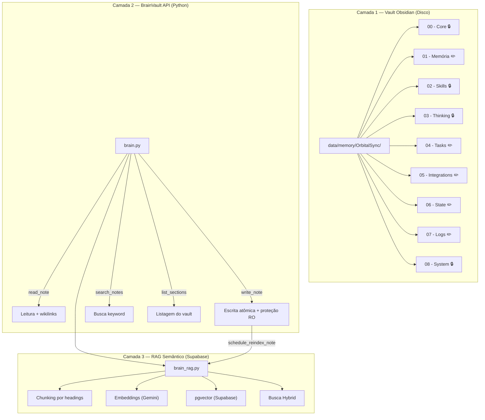

# Análise do Modelo de Memória — ATHENAS × Obsidian

## Veredicto Geral

> [!TIP]
> **Ficou muito bom.** A arquitetura é bem pensada, madura, e resolve problemas reais que a maioria dos projetos de "AI with memory" ignora. Você construiu algo que está mais próximo de um "segundo cérebro cognitivo" do que de um simples RAG + banco de vetores.

---

## 🏗️ Arquitetura em 3 Camadas

---

## ✅ Pontos Fortes

### 1. Separação RO/RW Inteligente
| Seção | Modo | Propósito |
|-------|------|-----------|
| `00 - Core` | 🔒 Read-Only | Identidade, personalidade, valores — a IA não pode se "re-programar" |
| `02 - Skills` | 🔒 Read-Only | Catálogo de capacidades — estável |
| `03 - Thinking` | 🔒 Read-Only | Frameworks de decisão — protegidos |
| `08 - System` | 🔒 Read-Only | Regras operacionais — imutáveis pela IA |
| `01 - Memória` | ✏️ Read-Write | Conhecimento persistente sobre o usuário |
| `04 - Tasks` | ✏️ Read-Write | Fluxo de trabalho vivo |
| `06 - State` | ✏️ Read-Write | Contexto volátil da sessão |
| `07 - Logs` | ✏️ Read-Write | Histórico e reflexões |

> [!IMPORTANT]
> **Isso é crucial.** Sem proteção RO, a IA poderia acidentalmente sobrescrever sua própria identidade ou modificar frameworks de decisão — um problema real em sistemas auto-modificáveis.

### 2. Regras Comportamentais Sofisticadas
O [Brain_vault.md](file:///c:/Projetos/OrbitalSync/data/memory/OrbitalSync/08%20-%20System/Brain_vault.md) tem duas regras absolutas que elevam muito a qualidade:
- **"Buscar antes de falar"** — Evita alucinações sobre dados pessoais
- **"Nunca expor internals"** — A experiência do usuário fica transparente; a ATHENAS "simplesmente lembra"

### 3. Busca em 3 Modos
O `search_brain` suporta:
- **keyword** — substring exato (rápido, sem dependência externa)
- **semantic** — embeddings via Gemini + pgvector (busca por significado)
- **hybrid** — combina os dois com deduplicação automática

Com fallback inteligente: se semantic falhar, volta para keyword silenciosamente.

### 4. Escrita Atômica + Reindex Automático
A [brain.py](file:///c:/Projetos/OrbitalSync/backend/orbital/services/brain.py) faz escrita atômica (temp file + rename — seguro com Obsidian aberto) e depois dispara `schedule_reindex_note` em thread daemon, mantendo o índice RAG atualizado sem bloquear a resposta.

### 5. Grafo de Conhecimento via Wikilinks
O uso de `[[wikilinks]]` em todas as notas cria um grafo navegável:
- A ATHENAS pode resolver links para descobrir notas relacionadas
- O Obsidian renderiza o grafo visualmente
- As conexões são bidirecionais e semânticas  

### 6. System Instruction Dinâmica
O [gemini_setup.py](file:///c:/Projetos/OrbitalSync/backend/orbital/assistant/gemini_setup.py#L130-L176) lê `00-Core`, `02-Skills` e `08-System` no momento da conexão para montar a system instruction do Gemini Live — a ATHENAS "acorda" já sabendo quem é.

### 7. Guia de Seções Bem Documentado
O [Guia_secoes_RW.md](file:///c:/Projetos/OrbitalSync/data/memory/OrbitalSync/08%20-%20System/Guia_secoes_RW.md) é excelente — com regras práticas de ouro, exemplos claros de "onde salvar o quê", e padrões de escrita (`overwrite` vs `append`).

---

## ⚠️ Pontos de Atenção / Sugestões

### 1. Memória Curto Prazo vs State — Overlap Possível
- `01 - Memória/Memoria_curto_prazo.md` e `06 - State/Contexto_atual.md` podem se sobrepor
- **Sugestão:** Definir no guia que `Memoria_curto_prazo` é para "coisas mencionadas nesta sessão que ainda não viraram memória de longo prazo" e `Contexto_atual` é puramente "sobre o que estamos falando agora"

### 2. Escalabilidade do Keyword Search
- O `search_notes()` faz `rglob("*.md")` + leitura de todos os arquivos a cada busca
- Com dezenas de notas é OK, mas se o vault crescer para centenas, vai ficar lento
- **Sugestão:** Implementar um cache em memória do índice de notas (invalidar no `write_note`)

### 3. Falta um Mecanismo de "Esquecimento"
- Não vi nenhum mecanismo para limpar/consolidar memórias antigas
- Com o tempo, `01 - Memória/Aprendizados.md` e `07 - Logs/Conversas.md` vão crescer indefinidamente
- **Sugestão:** Adicionar uma skill/tool de "consolidar" — periódicamente a IA resume e compacta logs antigos, ou move para um arquivo morto

### 4. `06 - State` Poderia Ter TTL
- Notas de state como `Contexto_atual` ficam "presas" no último valor mesmo se a sessão acabou há dias
- **Sugestão:** Adicionar timestamp na nota e fazer a ATHENAS ignorar/limpar contexto > 24h automaticamente

### 5. Thinking Section Poderia Ser Mais Rica
- As notas de `03 - Thinking` estão bem esqueletais (ex: Tomada de Decisão tem só 4 linhas)
- **Sugestão:** Expandir com exemplos e heurísticas — isso enriquece a capacidade de raciocínio da ATHENAS quando ela lê `02-Skills → 03-Thinking` no loop

### 6. Sem Versionamento das Notas
- O `write_brain` com `overwrite` não guarda versão anterior
- **Sugestão:** Antes de overwrite, salvar snapshot em `07 - Logs` ou manter `.bak` por X dias — útil para debug e para o Leo perguntar "o que a Athenas achava sobre X antes?"

---

## 📊 Resumo da Cobertura

| Aspecto | Status | Notas |
|---------|--------|-------|
| Identidade persistente | ✅ Excelente | 00-Core com proteção RO |
| Memória do usuário | ✅ Bom | wikilinks + append, pode melhorar consolidação |
| Busca semântica | ✅ Excelente | RAG hybrid com fallback |
| Proteção contra auto-modificação | ✅ Excelente | RO em seções críticas |
| Transparência pro usuário | ✅ Excelente | Regras absolutas de ocultação |
| Escrita segura | ✅ Excelente | Atômica + Obsidian-safe |
| Escalabilidade | ⚠️ Atenção | keyword scan O(n) sem cache |
| Esquecimento/Consolidação | ❌ Ausente | Crescimento indefinido |
| Versionamento | ❌ Ausente | Overwrite perde histórico |
| Documentação interna | ✅ Excelente | Brain_vault.md + Guia_secoes_RW.md |

---

## 🎯 Conclusão

Esse modelo de memória está **muito acima da média** do que se vê em projetos de assistentes com IA. As decisões de design mais importantes estão corretas:

1. **Obsidian como storage** — editável por humano, visível, com grafo
2. **Seções RO protegendo a identidade** — a IA não pode perder o "quem é"
3. **RAG hybrid** — não depende só de embeddings
4. **Regras comportamentais rígidas** — "buscar antes de falar" e "nunca expor internals"
5. **Escrita atômica** — seguro em uso real com Obsidian aberto

As sugestões que fiz são melhorias incrementais — o core está sólido. Parabéns, Leo! 🚀
